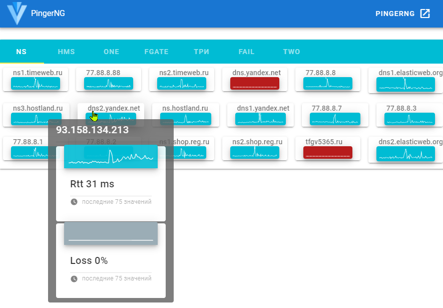

# PingerNG

Сервис проверки доступности хостов.

Собирает данные в Redis, выводит на web-интерфейс с построением графиков.

## Статистика
---
Хранение статистики осуществляется списком с именованием ключа по шаблону:
```
mkey_skey
```
* **mkey** - ключ адреса
* **skey** - ключ статистики

Например: 1.1.1.1_loss, 2.2.2.2_rtt

При чтении всех ключей функцией _GetAllHosts_ ключи статистики не добавляются в список хостов.

---
### Хранение статистики
Тип __Host__ в поле _Stats_ хранит список ключей статистики.

Не может быть пустым.

Например для ключа хоста "1.1.1.1" поле Stats = "loss,rtt", означающее что существуют ключи статистики
* 1.1.1.1_loss
* 1.1.1.1_rtt

Описанную схему использует бекенд для получения данных из БД.

---
{"Stats":[
    {"Type":"", "Values": []},
    {"Type":"", "Values": []}
]}


